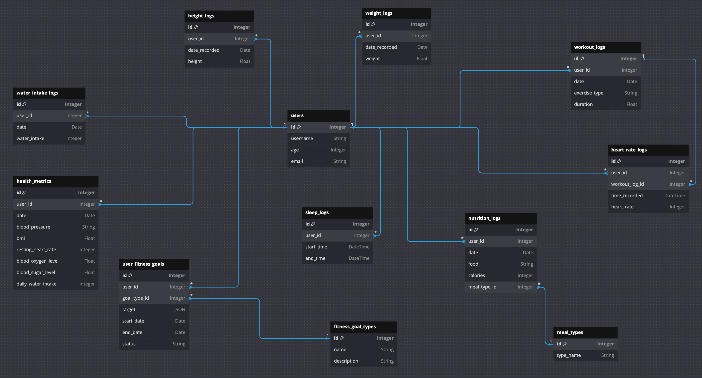

### Primary Objectives:
1. **Holistic Health Monitoring:** The app aims to provide users with a platform to track various aspects of their health and fitness, including physical activities, dietary habits, sleep patterns, and vital health metrics.
2. **Personalized Goal Setting:** Users can set specific fitness and health goals, tailoring their journey to their unique needs and preferences.
3. **Data-Driven Insights:** By analyzing the tracked data, the app can offer insights and recommendations, helping users optimize their routines for better results.

### Target Audience:
The app targets a wide range of users, from fitness enthusiasts and athletes to individuals seeking to improve their general health or manage specific health conditions. **It's particularly useful for those who appreciate a data-driven approach to health and wellness.**

### Tracked Health and Fitness Metrics:

1. **Workout Data:** Tracks the type, duration, and frequency of physical activities. This helps users monitor their exercise habits and progress towards fitness goals.
   
2. **Nutrition Data:** Monitors dietary intake, including types of food consumed and caloric intake, crucial for managing diet plans and understanding nutritional habits.

3. **Sleep Data:** Captures sleep patterns, including sleep duration and quality, essential for understanding the impact of rest on overall health.

4. **Health Metrics:**
   - Blood Pressure: Important for cardiovascular health monitoring.
   - BMI (Body Mass Index): Provides a quick indication of body health in relation to weight and height.
   - Resting Heart Rate: A key metric for cardiovascular fitness.
   - Blood Oxygen Level: Essential for monitoring respiratory and circulatory health.
   - Blood Sugar Level: Critical for diabetes management and understanding glucose patterns.
   - Daily Water Intake: Tracks hydration, an often overlooked aspect of health.

5. **Heart Rate Data:** Monitors heart rate, especially during workouts, to understand cardiovascular exertion.

6. **Height and Weight Logs:** Track changes in height and weight over time, useful for growth monitoring and weight management.

### Benefits to Users:

1. **Achieving Fitness Goals:** By setting and tracking specific fitness objectives (like weight loss, running a certain distance, etc.), users can stay motivated and measure their progress.

2. **Health Management:** The app assists in managing and preventing health conditions by tracking vital health metrics and encouraging healthy habits.

3. **Improved Awareness:** Continuous monitoring of health data helps users become more aware of their bodies and the impact of their lifestyle choices.

4. **Convenience:** Centralizing various health metrics in one app makes it easier to manage and review personal health data.

5. **Data Visualization and Analysis:** By visualizing data trends over time, users can gain insights into their health and fitness journey, aiding in informed decision-making.

In summary, the Health and Fitness Tracking App serves as a versatile tool for users to monitor various aspects of their health, set and achieve personal goals, and make data-informed decisions to lead a healthier lifestyle.


### DataBase Schema Design

The image below shows the database schema for the Health and Fitness Tracking App:



I made the following design decisions while creating the schema:

- I decided to keep height and weight logs in a separate table to allow for multiple entries over time.
- The health metric table is for data that is not tracked over a short period of time (like height and weight logs), but rather for data that is tracked at a specific point in time (like blood pressure, blood sugar, etc.) and aggregate data (like daily water intake, and resting heart rate).
- I decided to keep the heart rate data in a separate table to allow for multiple entries over time.
- In the heart rate logs table, I added an optional column to link heart rate data to a specific workout. This allows users to understand the heart rate impact of different types of workouts.
- For Nutrition Data, I decided to keep meal types in a separate table because there are a limited number of meal types (breakfast, lunch, dinner, and snacks). This also allows users to track the types of food consumed at different times of the day.
- In the each table, I added indexes for the columns that are most likely to be used in queries. For example, in the sleep logs table, I added indexes for for the start and end times of sleep because queries involving sleep duration are likely to use these columns.
- In all tables that have user_id as a foreign key, I added an index for the user_id column because it is likely to be used in all queries.


### Query Scenarios
Here are some Important queries that can be executed using the database. These queries are implemented in the `queries.py` file.

1. **Total Workout Duration**
   - `get_user_total_workout_duration(session, user_id, start_date, end_date)`
   - Calculates the total time a user has spent working out within a specified date range.

2. **Average Daily Caloric Intake**
   - `get_user_avg_daily_caloric_intake(session, user_id)`
   - Computes the average daily caloric intake for a user.

3. **Average Sleep Duration**
   - `get_user_avg_sleep_duration(session, user_id)`
   - Determines the average duration of sleep per day for a user.

4. **Weight Records Over Time**
   - `get_user_weight_records(session, user_id)`
   - Retrieves a user's weight log entries, showing changes in weight over time.

5. **Users Not Meeting Sleep Goals**
   - `get_users_not_meeting_sleep_goals(session, sleep_hours_goal)`
   - Identifies users who are not achieving their targeted sleep hours.

6. **Daily Water Intake**
   - `get_user_daily_water_intake(session, user_id, specific_date)`
   - Calculates the total amount of water a user has consumed on a specific date.

7. **Recent Blood Pressure Readings**
   - `get_user_recent_blood_pressure(session, user_id, number_of_records=5)`
   - Fetches the most recent blood pressure readings for a user.

8. **Average Heart Rate During Workouts**
   - `get_user_avg_heart_rate_during_workouts(session, user_id)`
   - Computes the average heart rate of a user during their workout sessions.


### Executing the Code

#### Step 1: Create a Virtual Environment
Create a virtual environment using the following command:

```python
python3 -m venv venv
```

#### Step 2: Activate the Virtual Environment
Activate the virtual environment using the following command:

```python
source venv/bin/activate
```

#### Step 3: Install Dependencies
Install the required dependencies using the following command:

```python
pip install -r requirements.txt
```

#### Step 4: Run the Code
Run the script to do the following:
- Create the database.
- Create the tables.
- Populate the tables with sample data.
- Execute the queries.
- Display the results.

```python
python main.py
```

#### Testing the Code
To run the unit tests, use the following command:

```python
python -m unittest tests.py
```